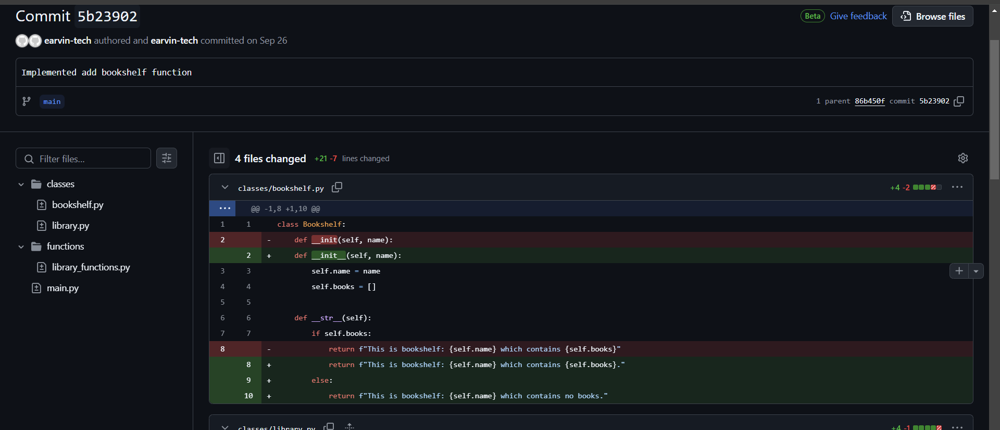
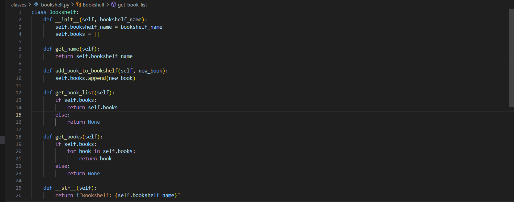
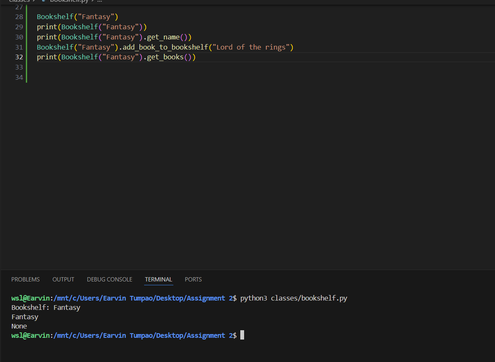
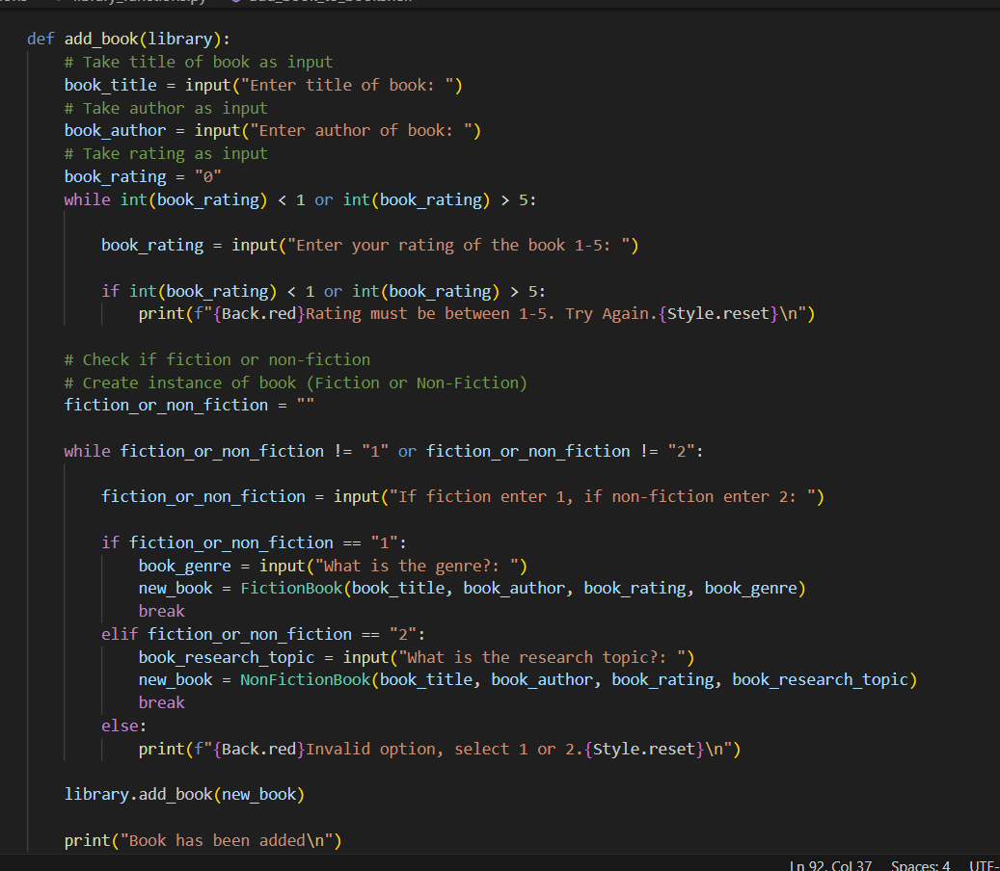

# Version Control & Testing Evaluation

## Overview
This report outlines some version control systems widely used by developers in the industry, it will highlight two specific version control systems Git and Mercurial. Use of Git will also be demonstrated in its use in one of my past projects; The personal library app.

This report also includes an analysis of test-driven development and once again will be demonstrated in the Personal Library App.

## What is Git?
Git is a version control system that tracks changes in in files of a particular directory known as a 'repository'. A repository is created when you choose to initialise a directory into one. 

There are three main stages a directory can have when using git. That is the working tree, staging area, and the repository. There are also two types of repository, a local repository and remote repository. The local repository is a repository in the local machine whereas the remote repository is saved in a platform such as GitHub or Bitbucket.

The first step in any project utilising Git is to initialise a directory into a repository. You can do this by entering in your terminal the command: ``` git init ```. After this any changes in files in the directory will be tracked. 

Any changes in a repository will be tracked however to 'commit' a change it must first be staged. We can stage files and their changes by entering the command ```git add [FILENAME]```.

After files have been staged they are ready to be committed. You can do this by entering ```git commit```, this will open up an editor such as vim, if you would like to not open an editor it would be easier to add a commit message directly like this: ```git commit -m "[MESSAGE]"```. After committing all changes or modifications in the added in the staging area will be committed. 

For collaborative projects it is useful to 'push' commits to a remote repository. This allows the project to be updated in real time with many other collaborators. Pushing commits to a remote repository are also a good way to back-up work in the event your device is unavailable. To push a commit from a local repository to a remote one on a platform such as GitHub we use the command: ```git push```. 

### GitHub
GitHub is an online platform that allows developers to collaborate on projects. It tracks a project in what is called a repository. Code is committed from a local repository to a remote repository on GitHub where collaborators can all contribute and access the code.

One unique feature of GitHub is its issue tracking that allows developers to highlight features that need fixing in a project. It allows projects that have multiple collaborators to comment on certain parts of code that needs work and delegate the work accordingly. 

## What is Mercurial?
Just like Git, Mercurial is also a version control system. It's very similar to Git having a repository track changes within it through commits. 

Here is some of the basic commands explained above with Git but in Mercurial syntax:
- Initialising repository: ```hg init```
- Adding files (to be tracked): ```hg add```
- Committing: ```hg commit```
- Pushing: ```hg push```


Both Git and Mercurial are free and open source with both having A GNU license. As both are very accessible many developers will choose one of these two as their version control system. 

However one difference from Git is the lack of a 'staging area'. This is a disadvantage for separating work as developers cannot pick and choose which changes to commit now or later. All changes must be committed at the same time. 

Another major difference between Git and Mercurial is the branching and merging structure. Git allows there to be multiple independent local branches of a repository. Creation, merging, deletion of these lines can be done very quickly. In Mercurial branching is more complex. Branches in Mercurial require its own directory. This makes branching in Mercurial much harder. 

Though both Git and Mercurial are popular many platforms prefer to host Git over Mercurial. Many platforms have dropped support for Mercurial over the years. BitBucket dropped support for Mercurial and Mercurial repositories were removed in 2020.

## Usage of Git and GitHub in my own project.
In a recent project of mine I opted to use Git as my version control system. It allowed me to efficiently track my progress as I implemented individual functions of the app I was creating. I utilised the pushing of commits to a remote repository on GitHub. This tracked any changes in my code to help me review it later to see if I was missing any functionality in my app. 

Below is an image of some commits I made to track my work:


These are snapshots of certain points in my project.


A specific commit. One that added implementation of the 'add bookshelf' function.

I did not use enough of other features which could have been useful such as branching which could have allowed me to work on different parts of the app if I got stuck on one part and then merged the branches into the main branch once completed. It would have helped with time management, whereas my method of working on one functionality at a time made progress flat at times. I had no use for forking the repository or cloning it as I only worked on one device and did not have any collaborators. 

Another feature that I could have explored was issue raising, though it is more often used in collaborative projects to highlight issues to be fixed in code, it would have allowed me to separate my work into pieces.

## Manual testing and Automated testing

### Manual Testing
Manual Testing is done physically by a person by interacting with the software and appropriate APIs. It is more prone to error as it has the potential for human made errors such as typos, or lack of understanding of what exactly must be tested. 

### Automated Testing
Automated testing is done by a machine that executes a pre-written test script. Errors still may occur if the test script is written incorrectly, or if some test outcomes are not taken into consideration. 

## Integration Testing and Unit Testing

### Unit Testing
Unit testing is very small scale. It is done to test individual methods, classes, components or, modules. An important factor of unit testing is to make sure it tests the smallest possible piece of code that can be isolated in a system. This is because if it relies on an external system such as a database, it no longer is a unit test but rather an integration test.

### Integration Testing
Integration testing is the testing of modules or services of a software working together. This can test for connection to a database, or different methods found in other modules being accessed by each other and working.

## Test-driven development
Test-driven development puts an emphasis on writing tests first and then writing and adjusting accordingly the application code. This allows a lessened work load. 

Many developers might struggle with the concept of test-driven development because it's a contrary mindset to what most are used to, it seems like working backwards. Writing tests first and only after writing code to pass the tests seems like tedious work. Though in reality this can save a lot of time, to have the functionality planned and documented and to have plan for outcomes, pass or fail.

## Test-driven development in my own project.
Test-driven development was used in my project loosely and not with much detail and thought in the testing. It would have been better if I had detailed the tests more before writing application code. Because the tests were not as detailed a possible some tests did not account for every outcome and errors were missed and not even considered.

The two main tests I had used in my project: The Personal Library App were the unit testing and integration testing. I will highlight these two test methods with various functions of the app. 

The unit tests run will be testing the methods of a certain class, to check if they retrieve or set the data as intended.


The methods to be tested are 'get_name', 'add_book_to_bookshelf', 'get_book_list' and 'get_books'. These methods are used in other functions in the project to retrieve or set information the user has input.

We can also test the constructor function and str function to check if they work.


The results of the unit tests of the methods in the Bookshelf class are as above. The constructor function and str function has appeared to work as it stored the name of the defined bookshelf correctly as stated in the definition of the str function. The 'get name' method has also worked as it has output the name of the defined bookshelf 'Fantasy' correctly.

However the test fails with the 'add book to bookshelf' and possibly the 'get books' method. Though we attempted to add a book to the bookshelf it has not output it when we requested to retrieve the book list of the bookshelf. This means we must modify the application code of one or both of these methods, either the book was not appended in the book list by the 'add book to bookshelf' method of the bookshelf or the getter method 'get books' is not working. 

Next we will be undergoing integration testing. In this example we will be testing the 'Add book' function. This function is to add a book to the library. At the same time the 'list all books' function will be tested so we can see the results of the 'add book' function. This will be considered an integration test as it tests to see not only single methods and classes but external modules and file handling methods utilising JSON files. 

Below is the functions and modules to be tested for the integration test:

.png)

When testing the two functions 'add book' and 'list all books' it tests the output of multiple methods working together as well as the file functions that are utilised by JSON which will be demonstrated shortly.

```py
import json

from classes.bookshelf import Bookshelf
from classes.fiction_book import FictionBook

def save_and_exit(library):
    json_to_write1 = []
    for bookshelf in library.get_all_bookshelves():
            if bookshelf.get_books():
                i = 0
                for book in bookshelf.get_book_list():
                    bookshelf_json = {
                        "bookshelf_name": bookshelf.get_name(),
                        f"book{i}": {
                            f"title{i}": book.get_title(),
                            f"author{i}": book.get_author(),
                            f"rating{i}": book.get_rating(),
                            f"genre{i}": book.get_genre()
                        }
                }
                
            else: 
                bookshelf_json = {
                    "bookshelf_name": bookshelf.get_name()
                }

            json_to_write1.append(bookshelf_json)
    
    with open("data/library.json", "w") as json_file1:
        json.dump(json_to_write1, json_file1, indent=4)

    json_to_write2 = []
    for book in library.get_all_books():
        if book.get_genre():
            books_json = {
            "title_book": book.get_title(),
            "author_book": book.get_author(),
            "rating_book": book.get_rating(),
            "genre": book.get_genre()
        }
        elif book.get_research_topic():
            books_json = {
            "title_book": book.get_title(),
            "author_book": book.get_author(),
            "rating_book": book.get_rating(),
            "research_topic": book.get_research_topic()
        }
        json_to_write2.append(books_json)

    with open("data/books.json", "w") as json_file2:
        json.dump(json_to_write2, json_file2, indent=4)
        
        

def load_from_file(library):
    try:
        with open("data/library.json", "r") as json_file1:
            json_to_load1 = json.load(json_file1)

        for bookshelf in json_to_load1:
            bookshelf = Bookshelf(bookshelf["bookshelf_name"])
            if bookshelf.get_books():
                i = 0
                for book in bookshelf.get_books():
                    book = FictionBook(f"title{i}", f"author{i}",f"rating{i}", f"genre{i}")
                    bookshelf.add_new_book_to_bookshelf(book)
                    i += 1
            
            library.add_bookshelf(bookshelf)

    except FileNotFoundError:
        print("The file does not exist")

    try:
        with open("data/books.json", "r") as json_file2:
            json_to_load2 = json.load(json_file2)
        
        for book in json_to_load2:
            if book["genre"]:
                book = FictionBook(book["title_book"],book["author_book"], book["rating_book"], book["genre"])
            library.add_book(book)
    
    except FileNotFoundError:
        print("File does not exist")
```
These functions are file functions which utilise JSON. 

These functions allow data to be persistent when closing and opening the app. The following integration tests will be able to test if the JSON and other external modules are working properly.

.png)
This is an integration test, by adding two books to the library we will see if the different modules all work together. The add book functions seems to work well storing the data input by the user.

.png)
When we employ the list books function and we see the books we input are listed and these functions work together as intended.

.png)
Here we see that the books we input have been stored in a JSON file as intended. 


## References

- Achilleas Pipinellis (2018). GitHub essentials : unleash the power of collaborative development workflows using GitHub. Burmingham, U.K., Packt Publishing Limited.
- Chacon, S. and Straub, B. (2014). Pro Git. [online] Berkeley, Ca: Apress. Available at: https://git-scm.com/book/en/v2.
- git-scm.com. (n.d.). About - Git. [online] Available at: https://git-scm.com/about/branching-and-merging.
- git-scm.com. (n.d.). About - Git. [online] Available at: https://git-scm.com/about/staging-area.
- Juviler, J. (2022). What Is GitHub? (And What Is It Used For?). [online] blog.hubspot.com. Available at: https://blog.hubspot.com/website/what-is-github-used-for#what-github.
- O’Sullivan, B. (2009). Mercurial: The Definitive Guide. ‘O’Reilly Media, Inc.’
- Pittet, S. (2019). The different types of testing in Software. [online] Atlassian. Available at: https://www.atlassian.com/continuous-delivery/software-testing/types-of-software-testing.
- QualityLogic. (2024). A Closer Look at Integration Testing. [online] Available at: https://www.qualitylogic.com/knowledge-center/closer-look-integration-testing/.
- Soundsoftware.ac.uk. (2014). What’s the difference between Mercurial and git? | Sound Software .ac.uk. [online] Available at: http://soundsoftware.ac.uk/whats-the-difference-between-hg-and-git [Accessed 27 Oct. 2024].
- Sruthy (2007). Types of Software Testing: Different Testing Types with Details. [online] Software Testing Help. Available at: https://www.softwaretestinghelp.com/types-of-software-testing/#1_Unit_Testing.
- www.mercurial-scm.org. (n.d.). Mercurial SCM. [online] Available at: https://www.mercurial-scm.org/guide.

Link to project referenced: Personal Library App -> [Link to repo.](https://github.com/earvin-tech/Assignment-Terminal-App)